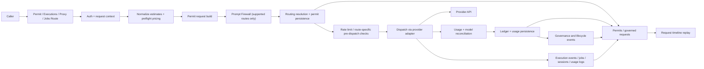

# Architecture

Keel is implemented as a permit-driven governance layer with provider-neutral and provider-specific execution surfaces plus persisted lifecycle state.

## Runtime modes

| Mode | Public surface | What Keel owns |
| --- | --- | --- |
| Permit-first | `POST /v1/permits` then `POST /v1/permits/{permit_id}/usage` | decision, audit row, final usage closeout |
| Provider-neutral execution | `POST /v1/executions` | decision, routing, execution, usage, assets, request state |
| Unified execute | `POST /v1/execute` | resolved provider and model selection, decision, execution, usage, assets, request state |
| Provider-specific proxy | `POST /v1/proxy/*` | decision, execution, usage, assets, request state |
| Async jobs | `POST /v1/jobs` and `GET /v1/jobs/{job_id}` | job state, background execution, callbacks, usage, assets |
| Realtime session scaffolding | no public route yet | session persistence, usage metrics, execution events |

## Key components

| Component | Responsibility |
| --- | --- |
| Permit canonicalization | Normalizes compatibility payloads into the canonical permit shape. |
| Permit evaluation | Applies policy, pricing, budget guardrails, idempotency, and permit persistence. |
| Capability registry | Tracks operation-aware capabilities, execution modes, and routing fitness. |
| Routing | Resolves provider-bound selection, fallback state, and routing metadata. |
| Prompt Firewall | Inspects supported prompt-bearing execution paths before dispatch. |
| Execution spine | Runs the shared stage machinery used by governed execution routes. |
| Async jobs | Persists job state and background callback behavior. |
| Timeline replay | Reconstructs request chronology from persisted lifecycle tables. |
| Provider adapters | Translate provider-specific request and response behavior. |

## Architecture diagram

Permit evaluation is not a separate pre-routing step in the shared stage chain. The pipeline builds the permit request first, then performs prompt-firewall evaluation where present, then resolves routing and persists the permit inside the routing stage.

## Current architecture story

- Permit evaluation remains the canonical public governance seam.
- Keel exposes active public execution routes in addition to provider-specific proxy routes.
- Provider-native proxy routes still matter because payloads, translation, and streaming semantics differ materially by provider.
- The capability registry is operation-aware and execution-mode aware.
- Execution can persist asset summaries and multi-meter usage even when permit-time cost estimation is still token-priced.
- Request timeline replay is built from existing persisted lifecycle rows; it is not a separate event-store product.

## API surface hierarchy

- Canonical public:
  - `POST /v1/permits`
- Official public:
  - `POST /v1/execute`
  - `POST /v1/executions`
  - `POST /v1/permits/{permit_id}/usage`
  - `POST /v1/proxy/*`
  - `POST /v1/jobs`
  - `GET /v1/jobs/{job_id}`
  - `GET /v1/requests/{request_id}/timeline`
- Compatibility:
  - older path-bound permit create and OpenAI alias routes
- Internal/operator:
  - dashboard observability and gateway helpers
- Removed:
  - `POST /v1/generate`

See [Platform Surfaces](/docs/platform-surfaces) for the mounted route matrix and [Execution Spine](/docs/execution-spine) for the shared stage machinery.

## Beta doctrine

The current release gate is defined by a small set of non-negotiable invariants:

- one canonical governed execution spine
- service-layer enforcement of security-critical rules
- fail-closed behavior on indeterminate governance state
- strict tenant isolation
- durable terminal accounting
- explicit policy validation
- consistent guarantees across adapters

The full doctrine lives on [Beta Scope](/docs/beta-scope).

## Current limits

- no public realtime session API
- no autonomous routing claim
- no standalone event store behind timelines

## Next reading

- [Overview](/docs/overview)
- [What is Keel](/docs/what-is-keel)
- [System Overview](/docs/system-overview)
- [Execution Spine](/docs/execution-spine)
- [Platform Surfaces](/docs/platform-surfaces)
- [Quickstart](/docs/quickstart)
- [Threat Model](/docs/threat-model)
- [Security](/docs/security)
