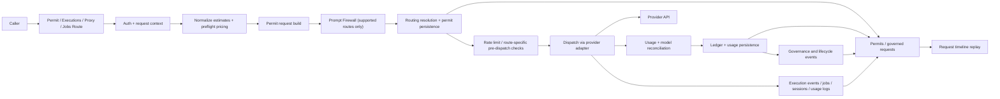

# Architecture

Keel is implemented as a permit-driven governance layer with provider-neutral and provider-specific execution surfaces plus persisted lifecycle state.

## Runtime modes

| Mode | Public surface | What Keel owns |
| --- | --- | --- |
| Permit-first | `POST /v1/permits` then `POST /v1/permits/{permit_id}/usage` | decision, audit row, final usage closeout |
| Provider-neutral execution | `POST /v1/executions` | decision, routing, execution, usage, assets, request state |
| Unified execute | `POST /v1/execute` | resolved provider and model selection, decision, execution, usage, assets, request state |
| Provider-specific proxy | `POST /v1/proxy/*` | decision, execution, usage, assets, request state |
| Async jobs | `POST /v1/jobs` and `GET /v1/jobs/{job_id}` | job state, background execution, callbacks, usage, assets |
| Realtime session scaffolding | no public route yet | session persistence, usage metrics, execution events |

## Shared pipeline

Permit evaluation is not a separate pre-routing step in the shared stage chain. The pipeline builds the permit request first, then performs prompt-firewall evaluation where present, then resolves routing and persists the permit inside the routing stage.

## Current architecture story

- Permit evaluation remains the canonical public governance seam.
- Keel exposes active public execution routes in addition to provider-specific proxy routes.
- Provider-native proxy routes still matter because payloads, translation, and streaming semantics differ materially by provider.
- The capability registry is operation-aware and execution-mode aware.
- Execution can persist asset summaries and multi-meter usage even when permit-time cost estimation is still token-priced.
- Request timeline replay is built from existing persisted lifecycle rows; it is not a separate event-store product.

## Current limits

- no public realtime session API
- no autonomous routing claim
- no standalone event store behind timelines

## Next reading

- [Overview](/docs/overview)
- [Quickstart](/docs/quickstart)
- [Security](/docs/security)
