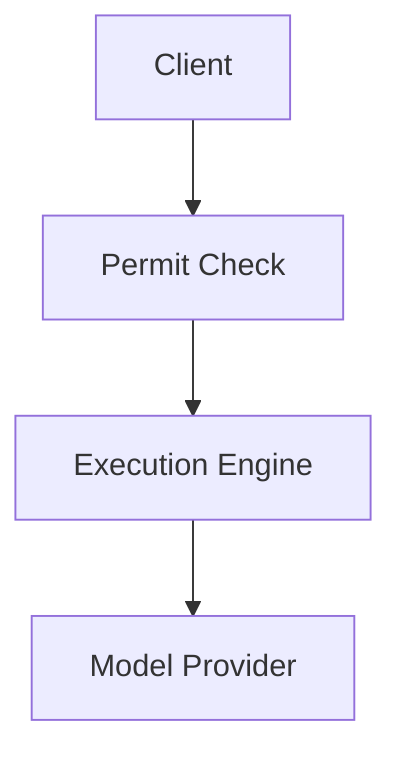

# Why Keel

Keel exists for teams that need AI execution to behave like the rest of a production system: policy-aware, repeatable, and auditable.

## The problem

AI integration often starts as a thin wrapper around one provider and then spreads into application code, background workers, and ad hoc middleware.

That creates a few predictable problems:

- policy enforcement gets scattered across services instead of staying in one decision path
- retries and idempotency behave differently across routes and jobs
- decision logging is incomplete, making incident review and audit trails harder
- model-provider governance becomes harder as teams add new vendors and fallback paths
- custom middleware layers accumulate edge cases around routing, usage tracking, and failure handling

The result is an AI stack that works for demos but becomes fragile under production constraints.

## What Keel does differently

Keel centralizes the parts of AI execution that usually get rebuilt in multiple places:

- centralized permit decisions for request approval and policy enforcement
- a provider-agnostic execution layer that can route governed requests across different model providers
- built-in governance primitives for policy, accounting, and control points
- deterministic execution logging so request history can be reconstructed from persisted state
- consistent retry and idempotency semantics across governed execution surfaces

This simplifies system architecture because governance no longer needs to be reimplemented in every caller, proxy, or worker. Applications can send requests through one governed path instead of stitching together separate policy checks, provider adapters, and audit logic.

## When to use Keel

Keel is a good fit when you need one or more of these properties:

- enforcing policies for AI requests before they reach a model provider
- coordinating execution across multiple model providers without duplicating control logic
- building auditability into AI systems with durable request and decision records
- running production AI workloads safely with consistent retry, routing, and accounting behavior
- centralizing AI governance instead of distributing it across application services

In practice, that usually means backend platforms, internal AI gateways, and production applications where model usage needs operational controls.

## When you don't need Keel

Keel is probably unnecessary if your setup is still simple:

- simple prototypes where direct provider calls are enough
- single-model experiments with no shared governance layer
- low-risk internal tools where auditability and policy enforcement are not strict requirements
- projects that do not need centralized governance, execution tracing, or durable controls

If the main goal is to test prompts quickly, a thin application wrapper is often the better starting point.

## Architecture diagram

## Related pages

- [Overview](/overview)
- [Quickstart](/quickstart)
- [Architecture](/architecture)
- [Permits](/permits)
- [Executions](/executions)
